# Task2.1

## Part 1. Hyporvisors

1. Most popular hypervisors are VMware vSphere, Microsoft Hyper-v, KVM, Virtual box, WMware server

2. I think that main difference between hypervisors is the way they run:

- run directly on system hardware (type 1). These are used in production environment.
- run on host OS (type 2). These are used in lab/test/soho.

  Other differences:

- type 1 hypervisor have high perfomance, better security, scalability and efficiency.
- type 2 hypervisor easy to use, has the better compatibility with the hardware.

## Part 2. Work with VirtualBox

1. Run VirtualBox and VM.
   - create VM1 and install Ubuntu Server (1.1-1-4)
     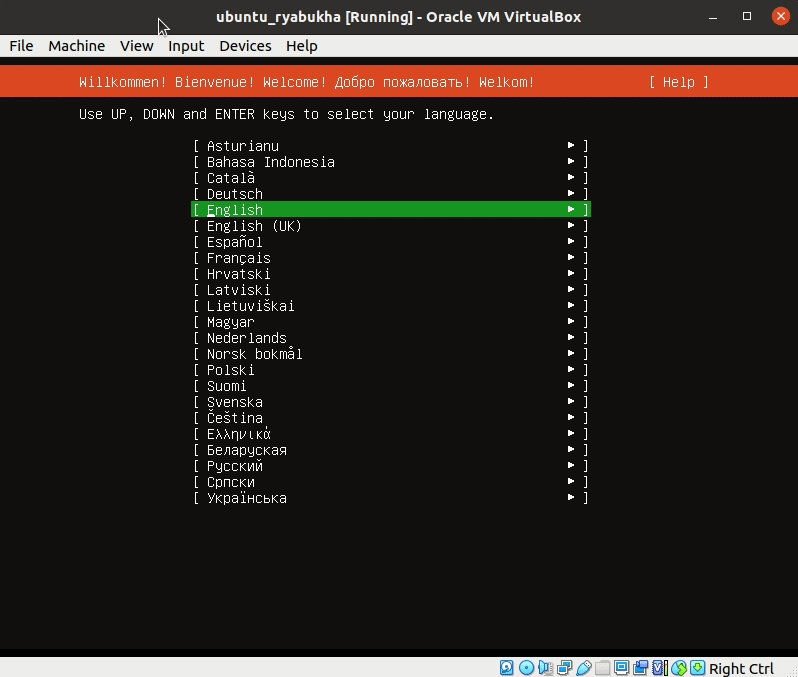
   - VM1 control - start, stop, reboot, save state (1.5)
     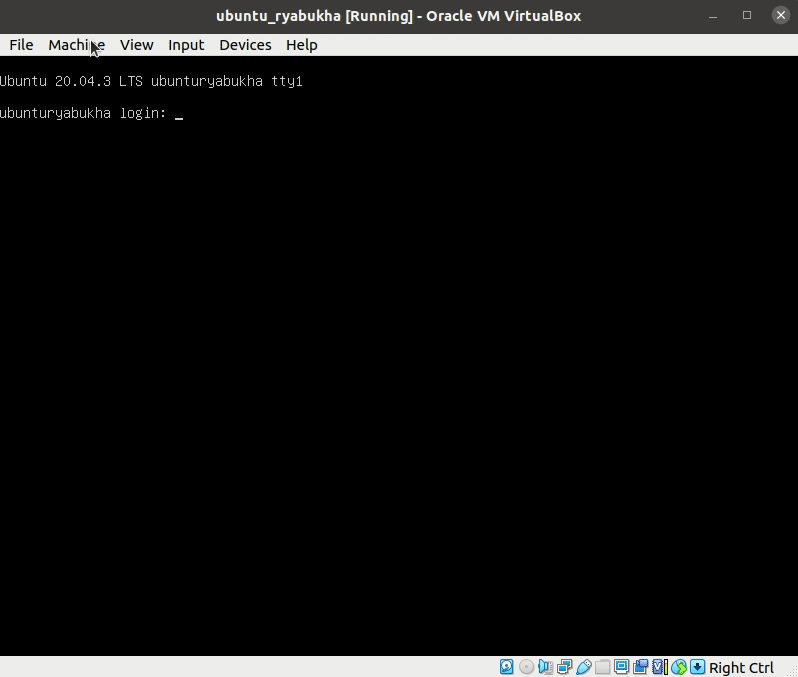
   - clone VM1 and create a groupe of two VM (1.6-1.7)
     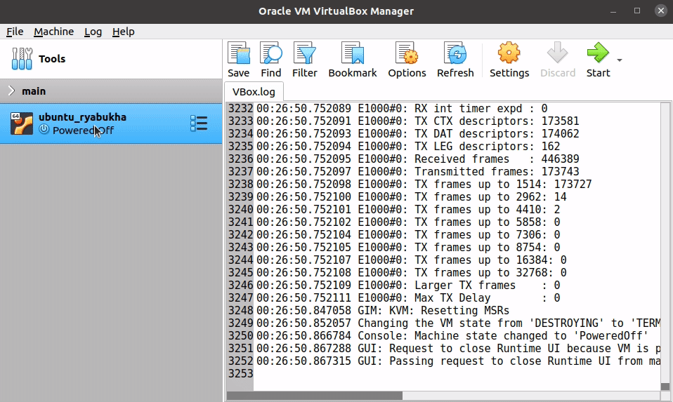
   - take several different snapshots (1.8)
     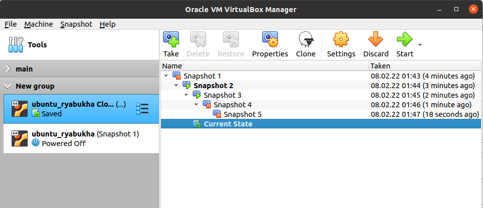
   - export/import VM (1.9)
     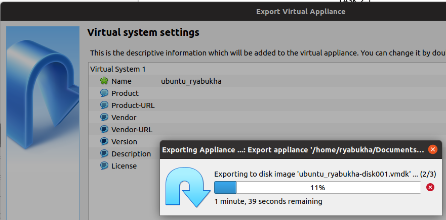
     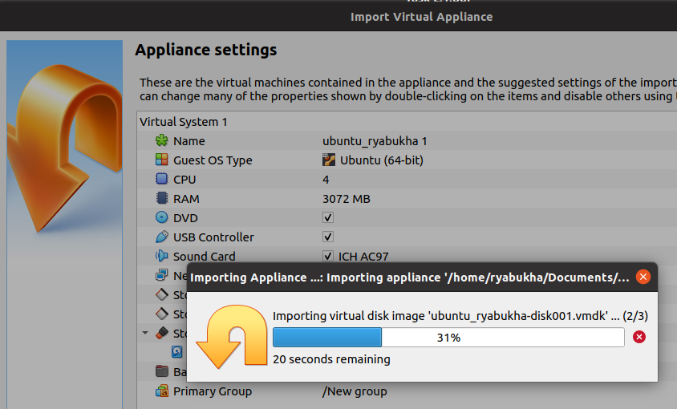
2. Configuration of VM.
   - connect usb, configure a shared folder (2.1-2.3)
     - grab usb storage
     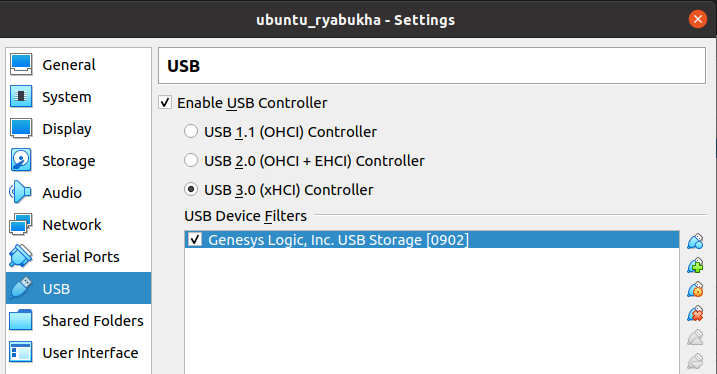
     - mount storage in vm
     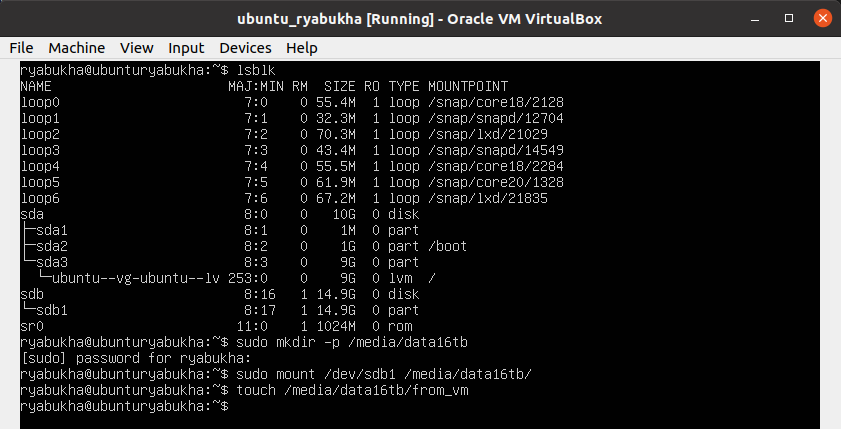
     - storage in host
     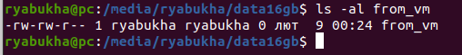
     - add shared folder
     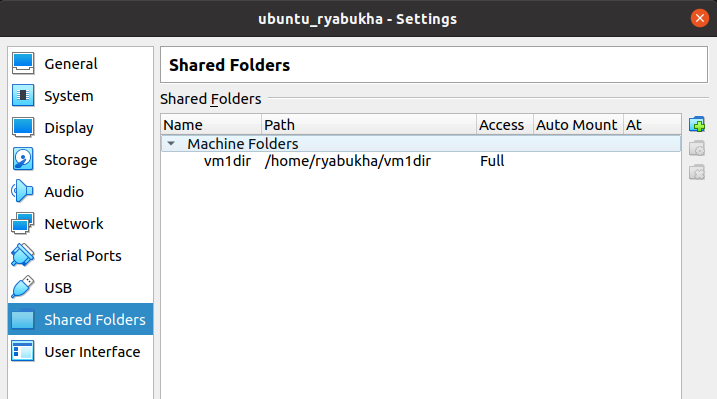
     - mount dir in vm
     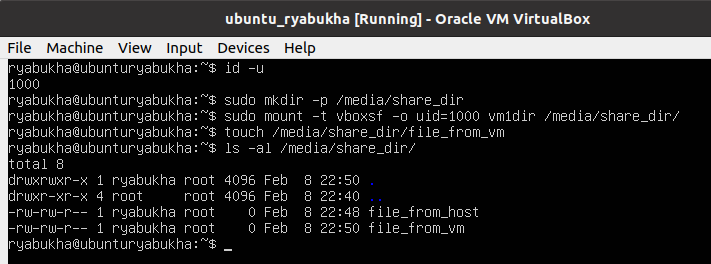
     - ls on host
     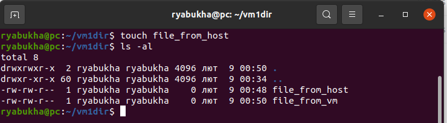
   - Check the connection between VM1, VM2, Host, Internet for different network modes

    | Mode         | VM-->Host | VM<--Host | VM1<->VM2 | VM-->Net(google.com) |
    | -----------: | :-------: | :-------: | :-------: | :------------------: |
    |  NAT         |     +     |      -    |     -     |       -              |
    | Bridged      |     +     |      +    |      +    |        +             |
    | Internal     |     -     |      -    |    +      |       -              |
    | Host-only    |     -     |      +    |      +    |        -             |
    |  NAT network |     +     |      -    |      +    |        +             |

3. Work with cli
