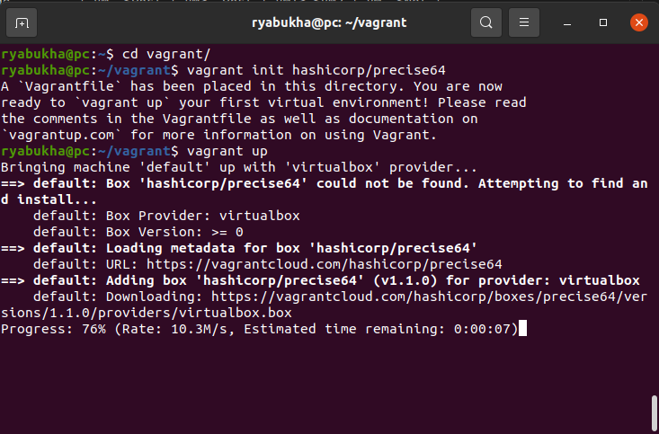
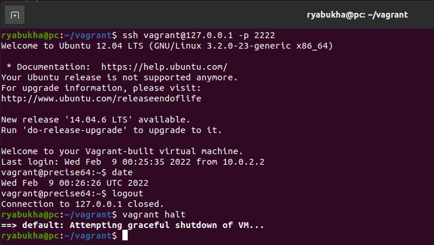
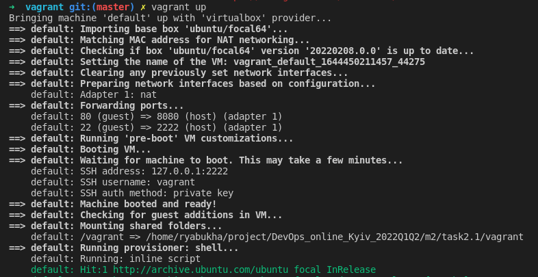
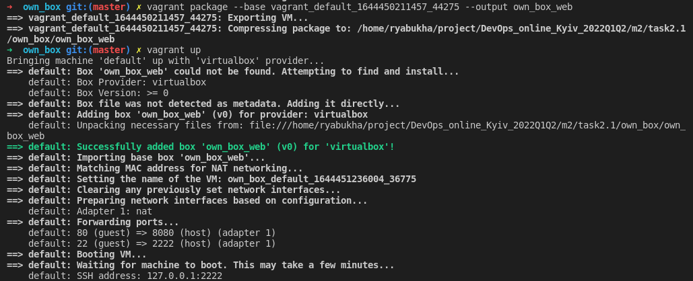
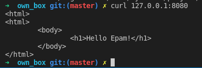

# Task2.1

## Part 1. Hyporvisors

1. Most popular hypervisors are VMware vSphere, Microsoft Hyper-v, KVM, Virtual box, WMware server

2. I think that main difference between hypervisors is the way they run:

- run directly on system hardware (type 1). These are used in production environment.
- run on host OS (type 2). These are used in lab/test/soho.

  Other differences:

- type 1 hypervisor have high perfomance, better security, scalability and efficiency.
- type 2 hypervisor easy to use, has the better compatibility with the hardware.

## Part 2. Work with VirtualBox

1. Run VirtualBox and VM.
   - create VM1 and install Ubuntu Server (1.1-1-4)
     
   - VM1 control - start, stop, reboot, save state (1.5)
     
   - clone VM1 and create a groupe of two VM (1.6-1.7)
     
   - take several different snapshots (1.8)
     
   - export/import VM (1.9)
     
     
2. Configuration of VM.
   - connect usb, configure a shared folder (2.1-2.3)
     - grab usb storage
     
     - mount storage in vm
     
     - storage in host
     
     - add shared folder
     
     - mount dir in vm
     
     - ls on host
     
   - Check the connection between VM1, VM2, Host, Internet for different network modes

    | Mode         | VM-->Host | VM<--Host | VM1<->VM2 | VM-->Net |
    | -----------: | :-------: | :-------: | :-------: | :------: |
    |  NAT         |     +     |      -    |     -     |       -  |
    | Bridged      |     +     |      +    |      +    |        + |
    | Internal     |     -     |      -    |    +      |       -  |
    | Host-only    |     -     |      +    |      +    |        - |
    |  NAT network |     +     |      -    |      +    |        + |

3. Work with cli

## Part 3. Work With Vagrant

- up box, connect to vm, halt box (1-7):


- create own box
  - first I created default [Vagrantfile](vagrant/Vagrantfile) for standart box ubuntu focal:
    ```vagrant init ubuntu/focal64```
  - then I changed this file. For example I have installed whith shell provisioner apache server and have set simple page. And I fixed futured problem whith ssh autentication:

    ```bash
    config.vm.provision "shell", inline: <<-SHELL
    apt-get update
    apt-get install -y apache2
    echo -e '<html>\n<html>\n\t<body>\n\t\t<h1>Hello Epam!</h1>\n\t</body>\n</html>' > /var/www/html/index.html
    wget --no-check-certificate https://raw.github.com/mitchellh/vagrant/master/keys/vagrant.pub -O /home/vagrant/.ssh/authorized_keys  
    chmod 0700 /home/vagrant/.ssh
    chmod 0600 /home/vagrant/.ssh/authorized_keys
    chown -R vagrant /home/vagrant/.ssh
    SHELL
    ```

  - then ```vagrant up```.
  
    

  - If all okey, I pack it in a box: ```vagrant package --base <vm_name> --output own_box_web```
  - I create another [Vagrantfile](own_box/Vagrantfile) whith ```config.vm.box = "own_box_web"``` and ```vagrant up```.
  
    

  - and check server:

    
