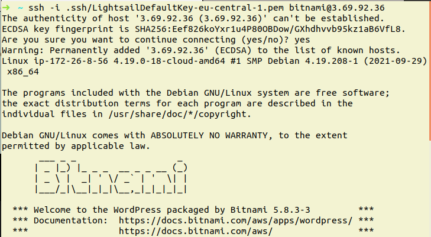
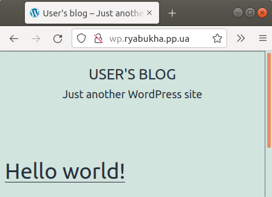
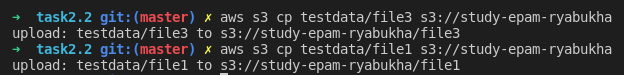
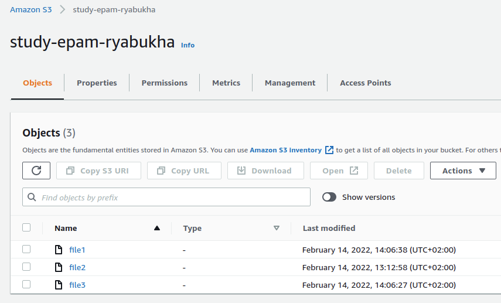

# Task2.2

10. Launch and configure a WordPress instancewith Amazon Lightsail

- I chose instance with wordpress
- I attached a static ip
- I connected via ssh
- I made an A-record and visited the site
 
 
 

11. I created s3-bucket

12. and Batch uploaded files to the cloud to Amazon S3 using the AWS CLI
 

 
13. later

14. I made an example "Hello, World!" with AWS Lambda.
 
15. Created a static website on Amazon S3 [link](https://ryabukha.pp.ua/study-epam.html).
