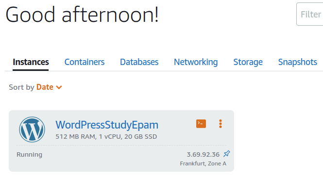
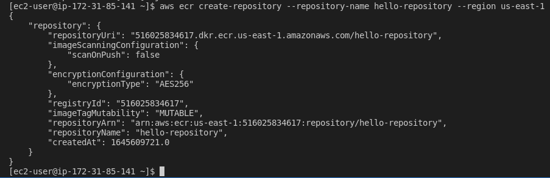
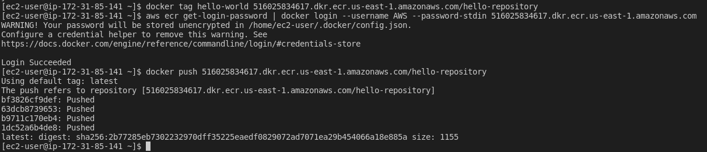
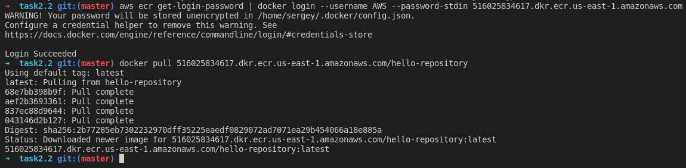
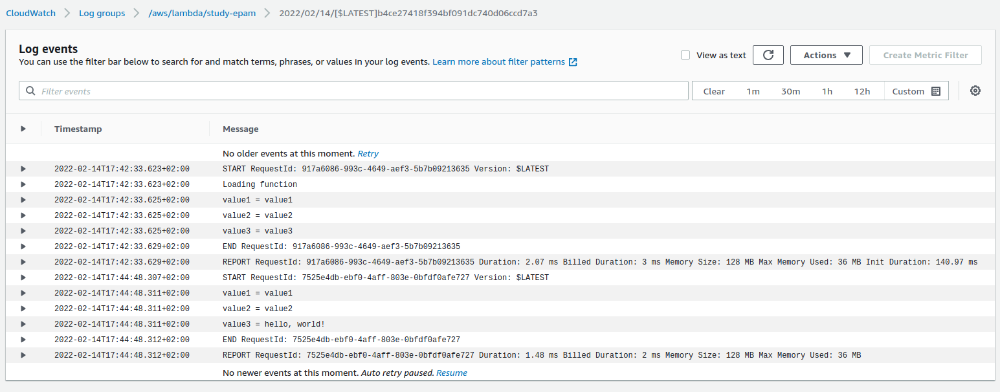

# Task2.2

10. Launch and configure a WordPress instancewith Amazon Lightsail

- I chose instance with wordpress
- I attached a static ip
- I connected via ssh
- I made an A-record and visited the site
  - 
  - 
  - 

11. I created s3-bucket

12. and Batch uploaded files to the cloud to Amazon S3 using the AWS CLI

- 

- 

13. I followed [this](https://docs.aws.amazon.com/AmazonECS/latest/userguide/docker-basics.html) instruction step by step. And...
    - I builded image and runned it
    - 
    - `curl`
    - 
    - I created repo:
    - 
    - I pushed image to repo:
    - 
    - and I checked to pull image:
    - 

14. I made an example "Hello, World!" with AWS Lambda.

- 

15. Created a static website on Amazon S3 [link](https://ryabukha.pp.ua/study-epam.html).
