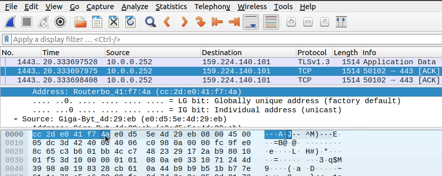

# Task3.1

## Create lab in Cisco Packet Tracer

- Created three networks: home office, data center, enterprise.
  - Enterprise network: `10.89.23.0/24`
  - home office: `192.168.0.0/24`
  - data center: `12.23.89.0/24`

- Checked network connectivity with `ping`:

## File pkt

- [task3.1](task3.1.pkt)

## Additional task. Viewed the packet structure using the Wireshark

- dst mac: `cc 2d e0 41 f7 4a`
- src mac: `e0 d5 5e 4d 29 eb`
- src ip: `10.0.0.252`
- dst ip: `159.224.140.101`
- src port: `50102`
- dst port: `443`
