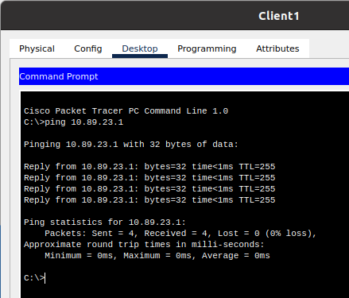
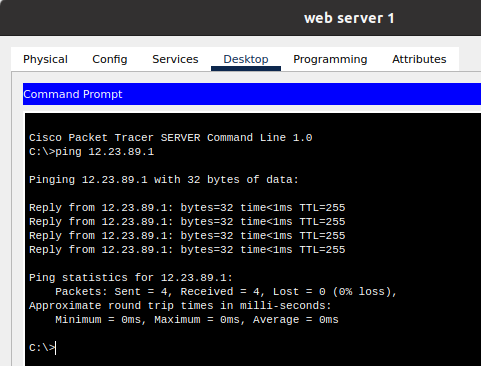
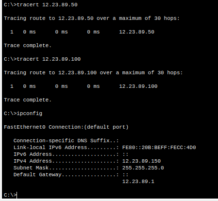
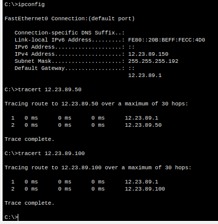
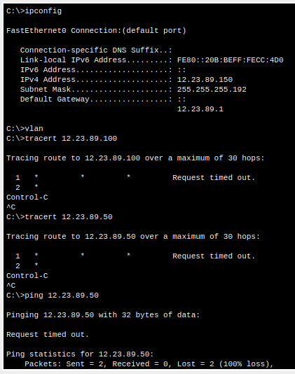
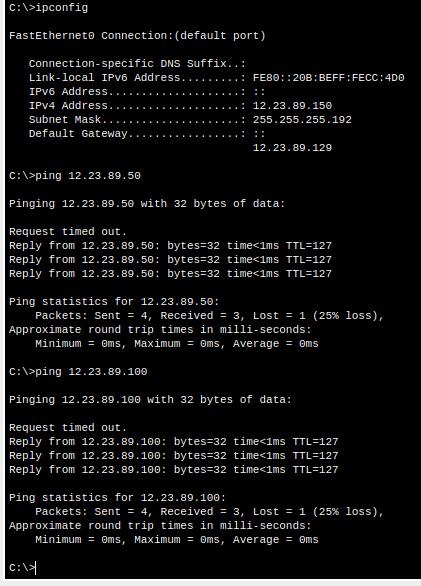
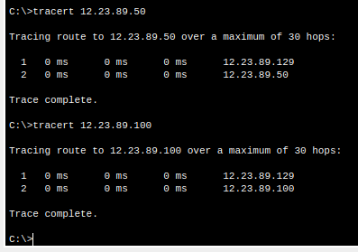

# Task3.2

## Connecting networks using the Internet and setting up a VLAN

- Checked the connection of computers to their own gateways with the `ping` command:

  - 

  - 

- Checked the connection between the servers with `ping` command and the packet route with `tracert`:

  - 

- Changed the subnet mask on the servers to `255.255.255.192`.
Again, I checked the connection between the servers with `ping` command and the packet route with `tracert`:

  - 

  The result of the `tracert` is different because the netmask is now `/26` (in the example this is the address range: `12.23.89.129 - 12.23.89.190`) and the server addresses (`12.23.89.50` and `12.23.89.100`) are not in this range. Therefore, the server sends packets through the gateway.

- Changed vlan on ports: FE0/2 - VLAN2, FE0/3 - VLAN3, FE0/4 - VLAN4. And checked connections:

  - 
  
  Now they are different networks.

## Optional. Configure routing between VLANs

- Set port FE0/1 in Data Center switch to trunk mode.

- I switched to CLI mode on the ISP3 router, and created three subinterfaces and configured them:
  - ip, mask
  - encapsulation dot1Q

- On Web Server1, Web Server2 and DNS Server, specify the gateways addresses 12.23.89.1, 12.23.89.65 and 12.23.89.129, respectively.

- Checked the connection between the servers with `ping` command and the packet route with `tracert`:
  - 
  - 

- File pkt: [task3.2.pkt](task3.2.pkt)
