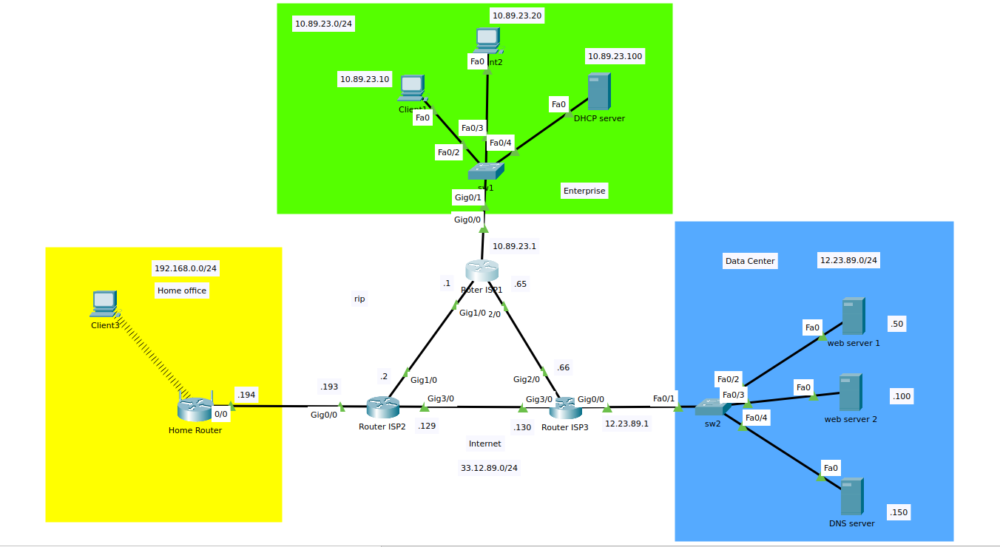
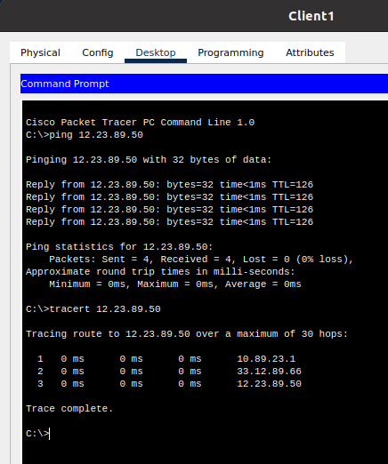
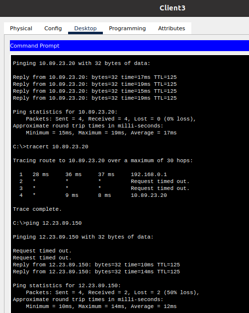
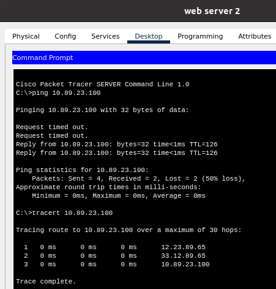
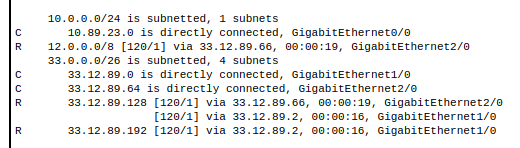
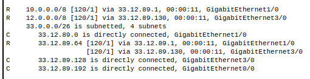
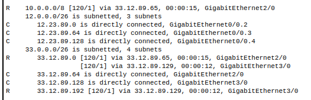
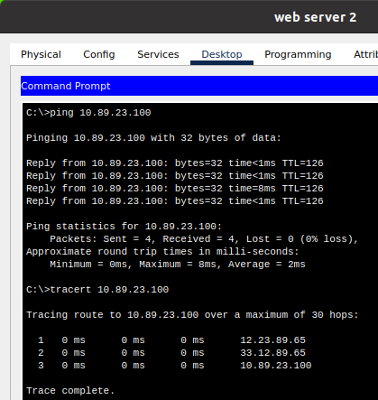
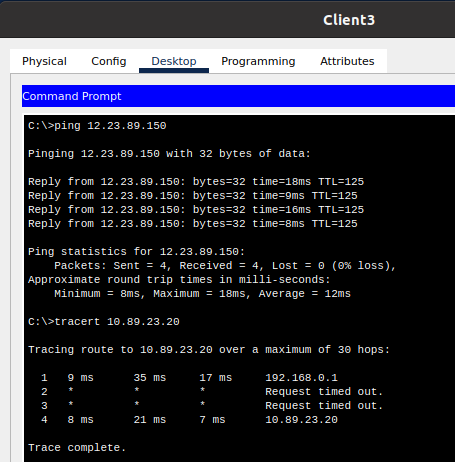
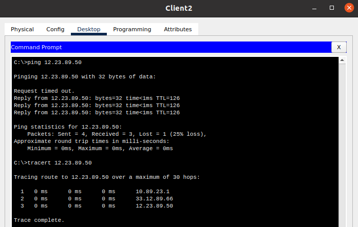

# Task3.3

## Routing settings

  
picture

  

- Configured routing tables on ISP1, ISP2, and ISP3 routers:
  - added route on ISP1:
    - net `12.23.89.0/24`, next hop `33.12.89.66`
    - net `33.12.89.192/26`, next hop `33.12.89.2`
  - added route on ISP2:
    - net `10.89.23.0/24`, next hop `33.12.89.1`
    - net `12.23.89.0/24`, next hop `33.12.89.130`
  - added route on ISP3:
    - net `10.89.23.0/24`, next hop `33.12.89.65`
    - net `33.12.89.192/26`, next hop `33.12.89.129`

- Checked the connection between the computers with `ping` command and the packet route with `tracert`:
  - 
  - 
  - 

## Optional. Rip

- On routers ISP1, ISP2 and ISP3 I configured the RIP protocol, for which I specified a list of directly connected networks in class format:
  - on ISP1: net `10.0.0.0`, `33.0.0.0`
  - 
  - on ISP2: net `33.0.0.0`
  - 
  - on ISP3: net `12.0.0.0`, `33.0.0.0`
  - 

- Checked the connection between the computers with `ping` command and the packet route with `tracert`:
  - 
  - 
  - 

## File pkt

- [task3.3.pkt](task3.3.pkt)
- [task3.3rip.pkt](task3.3rip.pkt)
