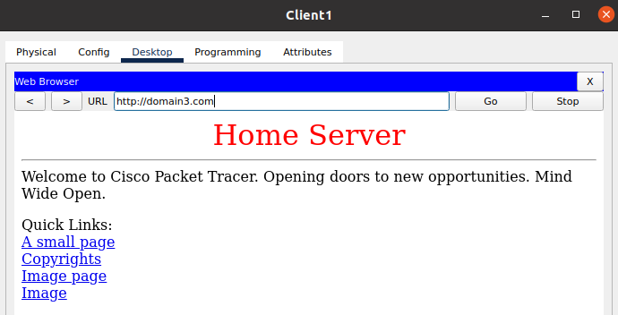

# Task3.4

## DHCP, DNS, NAT settings

  
picture

  

- I configured the DHCP Pool by specifying the starting address 10.89.23.10 and the Default Gateway address - the GE0 / 0 Router ISP1 interface address - 10.89.23.1.

- Checked the serviceability of the service by setting in the settings Client 1 and Client 2 DHCP:
  - 
  - 

- Configured DHCP on the Home Router and tested on Client 3:
  - 

- I made dns record in the DNS server settings for web server1 and web server2 and turned on the DNS service.
  - 

- Added DNS server address `12.23.89.150` to DHCP servers settings and updated client settings.
- I checked this by pinging to the domain name
  - 
  - 

## Optional. Configure Port Forwarding on the Home Router

- Added Home server to the Home Office network and assigned it a static address: `192.168.0.100`

- Set up Port Forwarding on Home Router.

- Added an entry for DNS Server for Home Server:
  - name: `domain3.com`
  - type: `A-record`
  - address: `33.12.89.194`

- Checked in Desktop/Web Browser:
  - 

## File pkt

- [task3.4.pkt](task3.4.pkt)
